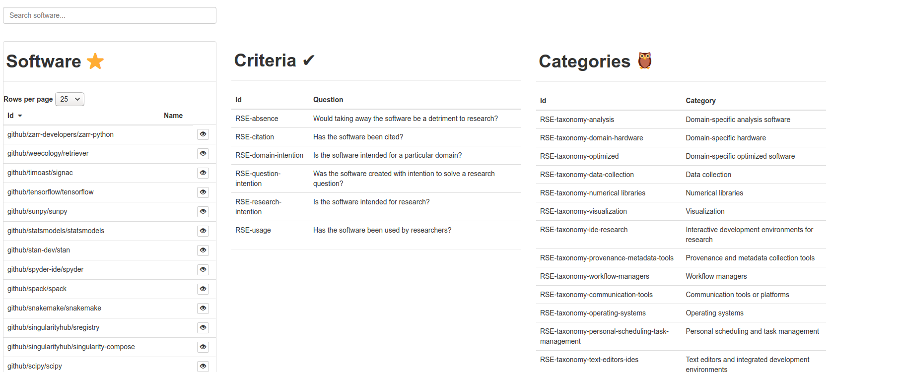
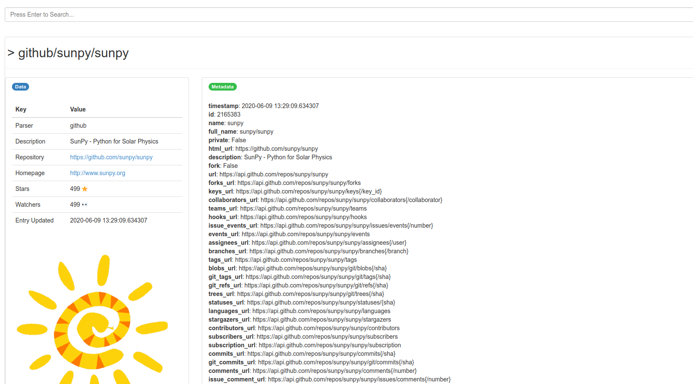

# Research Software Encyclopedia Action

[](https://rseng.github.io/) [](https://good-labs.github.io/greater-good-affirmation)

If you have a [research software encyclopedia](https://github.com/rseng/rse)
flat file "database" stored in a version controlled repository, you might want
to export a web interface to GitHub pages for users to explore it. This is
the purpose of this action. The portal currently looks like this:



And a repository like this:



An automated generation at [rseng/software](https://github.com/rseng/software) can
be viewed [here](https://rseng.github.io/software/).

## Quick Start

To use the action, you can specify this repository (a branch or preferably a release) and then
a path to some custom urls.txt files to include. For example, here is how to 
generate the interface for an external repository, and upload it as an artifact:

```bash
name: generate-web

on:
  pull_request: []

jobs:
  GenerateStaticWeb:
    name: Generate static web
    runs-on: ubuntu-latest
    steps:
      - name: Checkout Repository
        uses: actions/checkout@v2
      - name: Generate Static Web

        # Important! Update to release https://github.com/rseng/rse-action/releases
        uses: rseng/rse-action@master
        with:        
          repo: https://github.com/rseng/software
          config: rse.ini
          export_dir: docs
          force: true
      - name: Upload data as artifact
        uses: actions/upload-artifact@v2-preview
        with:
          name: static-web
          path: docs/
```

See [examples](examples) for this file and others with more detailed comments.

**important** you must define a **prefix** if you want to export to a GitHub
pages that isn't served at an organizations primary GitHub pages.

## Inputs

| name     | description                                        | default | required |
|----------|----------------------------------------------------|---------|----------|
|repo      | repository url or relative path to root of repo.   | .       | no       |
|config    | path to rse.ini config file to discover repository.| rse.ini | no       |
|export_dir| path to export directory.                          | docs/   | no       |
|force     | If export directory exists, force overwrite.       | unset (false)| no  |
|prefix    | A prefix for static export (for GitHub pages)      | /       | no  |
